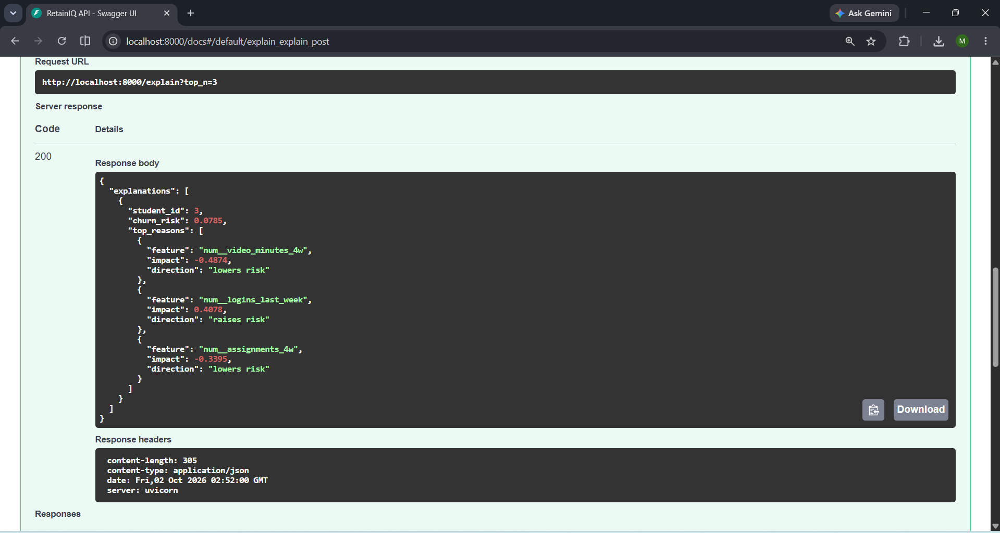
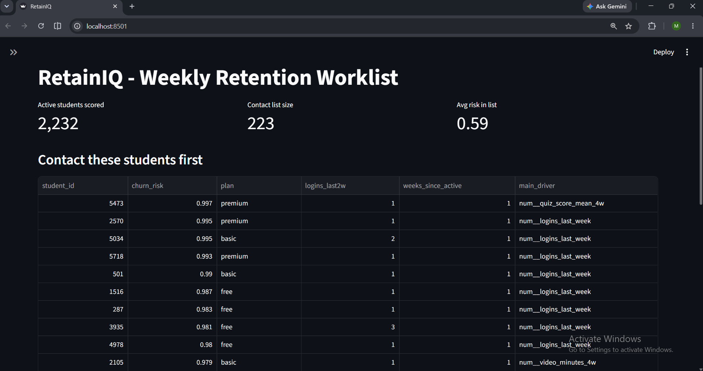

# RetainIQ: student churn prediction for an EdTech platform

A retention team can contact only a limited share of students each week (here: 10%). RetainIQ ranks active students by churn risk, explains the main driver for each one, and flags when the input data drifts, so the team calls the right people first.

The goal of this project is the engineering around the model: leakage-safe features, an honest time-based evaluation, capacity-aware metrics, an explanation API, a worklist dashboard and drift monitoring.

> The data is **synthetic**: a hidden "engagement" level drives both student behaviour and churn. The results show the pipeline works as designed, not real-world accuracy.

## Screenshots

| `/explain` API | Weekly worklist and drift table |
|---|---|
|  |  |

## Problem framing

This is a **ranking problem under a capacity constraint**, not an accuracy problem. The question is: "if the team can contact only the top 10%, how many real churners do they reach?" So the main metrics are PR-AUC, and precision, recall and lift at the top k%.

## How it works

```
SQLite (students, weekly_activity)
  -> SQL features (rolling windows, only weeks <= snapshot)
  -> time-based split: train 8-10, valid 12, test 14
  -> sklearn Pipeline (impute + one-hot) -> LogReg baseline / XGBoost
  -> MLflow (params, metrics) + saved model
  -> FastAPI: /predict, /explain (SHAP)      Streamlit: worklist + drift (PSI)
```

- **No future leakage.** Features come only from weeks up to the snapshot; the label comes only from the two weeks after it. A test deletes all later rows and checks that features do not change.
- **Time-based split.** Each split's label window must end before the next split's snapshot (enforced by a test).
- **Rolling-window features** so every feature means the same thing at every snapshot.
- **Eligibility.** Only students still active in the last two weeks are scored; students who already left are not "at risk".

## Results

Churn rate: 14.1% (train), 10.6% (valid), 10.6% (test). The model is chosen on validation PR-AUC; the test snapshot is only reported.

| Test snapshot (week 14) | LogReg baseline | XGBoost |
|---|---|---|
| PR-AUC | 0.651 | 0.644 |
| ROC-AUC | 0.887 | 0.875 |
| Top 10%: precision / recall / lift | 0.639 / 0.601 / 6.03 | 0.628 / 0.591 / 5.93 |
| Top 20%: recall | 0.763 | 0.763 |

Both models are practically equal (the differences are noise). XGBoost is kept so `/explain` can return SHAP drivers.

## Key engineering finding: drift monitoring caught a feature bug

The drift report showed PSI **0.27 (ALERT)** for `logins_early_avg`. The cause was not a change in student behaviour. The feature's baseline window grew with the snapshot week (2 weeks at snapshot 6, 10 weeks at snapshot 14), so the training data and the serving data used different definitions of the same column.

Fix: a fixed 4-week baseline window. PSI dropped to **0.093 (stable)**. Test metrics could not have revealed this; the drift monitor did. Two other features sit near 0.10 ("watch"), which is expected survivorship drift (students who stay are more engaged).

## API

```
POST /predict   risk probability per student
POST /explain   risk + top 3 SHAP drivers per student
GET  /health
```

Example `/explain` response (shortened):

```json
{"explanations": [{"student_id": 3, "churn_risk": 0.0662,
  "top_reasons": [{"feature": "num__video_minutes_4w", "impact": -0.52, "direction": "lowers risk"}]}]}
```

SHAP explains the **model**, not the real cause of churn.

## Limitations

- Synthetic data; no real A/B test of the retention outreach.
- The same student appears in several snapshots (train, valid and test), so splits are temporal, not by student.
- The model file must be loaded with the **same scikit-learn version it was trained with** (a model trained on one version fails to load on another). Retrain in the serving environment.
- The model file is stored in the repo for the demo; production would use a model registry (e.g. MLflow).
- The Dockerfile and the GitHub Actions workflow are included but were not run end to end.
- No automated retraining or alerting on drift.

## Project layout

```
src/
  config.py     settings, snapshot weeks, feature lists
  data_gen.py   synthetic data
  features.py   SQL feature layer + labels
  train.py      time-based split, models, MLflow, export
  monitor.py    PSI drift report
  api.py        FastAPI service
  dashboard.py  Streamlit worklist
tests/          11 tests: leakage, split integrity, API, drift, dashboard
docs/           screenshots
Dockerfile, requirements*.txt, .github/workflows/ci.yml
```

## Run it

Python 3.12 is recommended (some libraries have no wheels for 3.14 yet). The notebook `RetainIQ_clean.ipynb` runs the whole project on Colab.

Locally (Windows, Anaconda Prompt shown; use `export` instead of `set` on Mac/Linux):

```
conda create -n retainiq python=3.12 -y
conda activate retainiq
pip install -r requirements-dev.txt
set RETAINIQ_ROOT=E:\path\to\retainiq
python src\data_gen.py
python src\train.py
python -m pytest -q
uvicorn api:app --app-dir src --port 8000
streamlit run src\dashboard.py
```

## Tech

Python, SQLite, pandas, scikit-learn, XGBoost, SHAP, MLflow, FastAPI, Streamlit, pytest.
